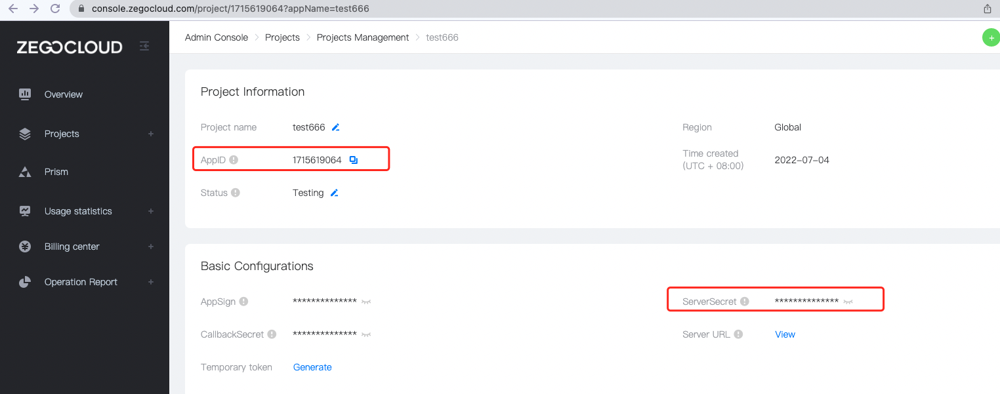
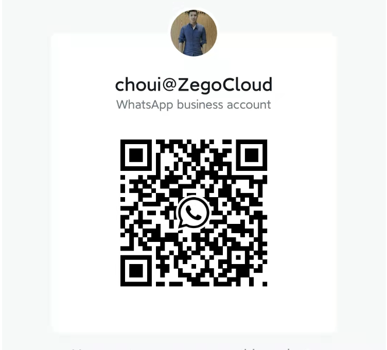

# ZEGOCLOUD Prebuilt Web SDK

- 2 interfaces to quickly implement 1v1 call , group call，live;
- pure JS language, support all frameworks (Reat, Angular, Vue,Ionic, etc.)
- 10,000 minutes free

## Quick integration

### 1v1 Call

##### [Experience online](https://zegocloud.github.io/zego_uikit_prebuilt_web/1on1_call/index.html)

#### [Integrated Documentation](https://docs.zegocloud.com/article/14728)

### Group Call

#### [Experience  online](https://zegocloud.github.io/zego_uikit_prebuilt_web/video_conference/index.html)

##### [Integrated Documentation](https://docs.zegocloud.com/article/14728)

### Live

### [Experience  online](https://zegocloud.github.io/zego_uikit_prebuilt_web/live_stream/index.html)

##### [Integrated Documentation](https://docs.zegocloud.com/article/14885)

### Video Conference

### [Experience  online](https://zegocloud.github.io/zego_uikit_prebuilt_web/video_conference/index.html)

##### [Integrated Documentation](https://docs.zegocloud.com/article/14922)

### Preparation before integration

1 Register a [ZEGOCLOUD ACCOUNT](https://console.zegocloud.com/account/signup) ----- >create a project ----- > get the project AppID, ServerSecret

## Principle introduction

The prebuilt sdk is based on the secondary packaging of the ZEGOCLOUD Express WebRTC SDK, so the upper limit of functions can include all the capabilities of the Express WebRTC SDK, and the same browser compatibility, error codes, weak network heavy chain, etc. are also consistent with it; [click me](https://docs.zegocloud.com/article/12307) to see more capabilities

The source code of this project is all in the src directory, written using react + typescript + scss, you can also extend it based on the source code; or scan the whatsapp QR code below to contact me for more benefits

