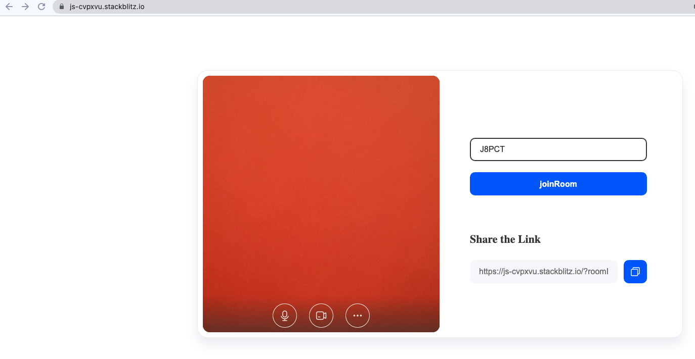

# ZEGOCLOUD Prebuilt Web SDK

* 2 interfaces to quickly implement 1V1 calls
* pure JS language, support all frameworks  (Reat, Angular, Vue,Ionic, etc.)
* 10,000 minutes free

## Quick integration

### [Experience Demo online](https://zegocloud.github.io/zegocloud_prebuilt_webrtc/build/index.html)

### Preparation before integration

1 Register a [ZEGOCLOUD ACCOUNT](https://console.zegocloud.com/account/signup)  ----- >create a project ----- > get the project AppID, ServerSecret


2 Register a [Heroku](https://signup.heroku.com/login) account to quickly build an authentication service

### Deploy the authentication backend interface

 [](https://heroku.com/deploy?template=https://github.com/choui666/dynamic_token_server_nodejs)

1. Click the deploy link above to start
2. Fill in your App name, APP_ID and SERVER_SECRET and press `Deploy App`
3. Make a cup of coffee and wait for heroku to finish :)
4. Once done you will get an url for your instance, for example: https://${}$xxxx.herokuapp.com

### Deploy your Web Call app

1 [Click me](https://signup.heroku.com/login) to create a javascript project ( if you do not have an account, please register one first )

2 Load the SDK in index.js, the code is as follows:

```javascript
// dynamically load plugins
function loadScript(url, callback) {
  const script = document.createElement('script');
  script.type = 'text/javascript';
  // Compatible with IE
  if (script.readyState) {
    script.onreadystatechange = function () {
      if (script.readyState === 'loaded' || script.readyState === 'complete') {
        script.onreadystatechange = null;
        callback();
      }
    };
  } else {
    // handle the case of other browsers
    script.onload = function () {
      callback();
    };
  }
  script.src = url;
  document.body.append(script);
}

// load plugin
loadScript(
  'https://zegocloud.github.io/zegocloud_prebuilt_webrtc/ZegoPrebuilt/index.umd.js',
  init
);
```

3 Initialize the SDK, the code is as follows

```javascript
async function init() {
  const roomID = getUrlParams(window.location.href)['roomID'] || randomID(5);
  const { token } = await generateToken(
    'https://xxxx.herokuapp.com',
    randomID(5),
    roomID,
    randomID(5)
  );
  const zp = ZegoUIkitPrebuilt.init(token);
  zp.joinRoom({
    container: appDiv,
    joinScreen: {
      inviteURL:
        window.location.origin + window.location.pathname + '?roomID=' + roomID,
      visible: true,
    },
  });
}
```

4 Replace the address "https://xxxx.herokuapp.com" with your own heroku interface address

5 Copy the following utility function to the front of the init function

```javascript
// get token
function generateToken(tokenServerUrl, userID, roomID, userName) {
  // Obtain the token interface provided by the App Server
  return fetch(
    `${tokenServerUrl}/access_token?userID=${userID}&userName=${userName}&roomID=${roomID}&expired_ts=7200`,
    {
      method: 'GET',
    }
  ).then((res) => res.json());
}

function randomID(len) {
  let result = '';
  if (result) return result;
  var chars = '12345qwertyuiopasdfgh67890jklmnbvcxzMNBVCZXASDQWERTYHGFUIOLKJP',
    maxPos = chars.length,
    i;
  len = len || 5;
  for (i = 0; i < len; i++) {
    result += chars.charAt(Math.floor(Math.random() * maxPos));
  }
  return result;
}

function getUrlParams(url) {
  let urlStr = url.split('?')[1];
  const urlSearchParams = new URLSearchParams(urlStr);
  const result = Object.fromEntries(urlSearchParams.entries());
  return result;
}
```

6 The preview effect is as follows,[Click me](https://stackblitz.com/edit/zegocloud-prebuilt?file=index.js) to see the full code



## More configuration is as follows

```typescript
 export interface ZegoCloudRoomConfig {
  container?: HTMLElement; // mount the container
  joinScreen?: {
    visible: boolean; // Whether to display the entertainment detection page, the default display
    title?: string; // title setting, default enter Room
    inviteURL?: string; // invite link, if empty, it will not be displayed, default empty
  };
  micEnabled?: boolean; // Whether to enable your own microphone, it is enabled by default
  cameraEnabled?: boolean; // Whether to open your own camera, open by default
  userCanToggleSelfCamera?: boolean; // Whether you can control your own microphone, enabled by default
  userCanToggleSelfMic?: boolean; // Whether you can control the body's own camera, enabled by default
  deviceSettings?: {
    audio: boolean; // whether to show audio settings
    video: boolean; // whether to display video settings
  };

  chatEnabled?: boolean; // Whether to enable chat, the default is open joinScreen: boolean, // Check whether the page is required before the call, the default is required
  userListEnabled?: boolean; //Whether to display the member list, not displayed by default
  notification?: {
    userOnlineOfflineTips?: boolean; //Whether to display member in and out, not displayed by default
    unreadMessageTips?: boolean; // Whether to display unread messages, not displayed by default
  };
  leaveRoomCallback?: () => void; // leave the room callback
}
```

## Principle introduction

The prebuilt sdk is based on the secondary packaging of the ZEGOCLOUD Express WebRTC SDK, so the upper limit of functions can include all the capabilities of the Express WebRTC SDK, and the same browser compatibility, error codes, weak network heavy chain, etc. are also consistent with it;  [click me](https://docs.zegocloud.com/article/12307) to see more capabilities

The source code of this project is all in the src directory, written using react + typescript + scss, you can also extend it based on the source code; or scan the whatsapp QR code below to contact me for more benefits


